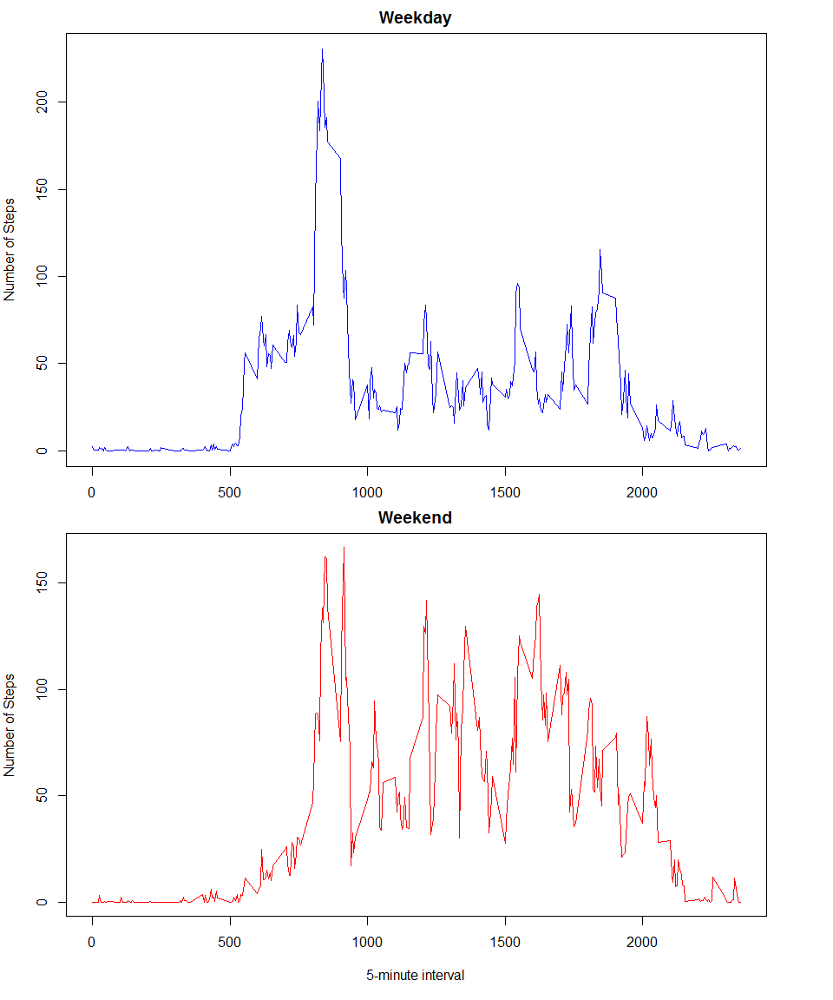

# Reproducible Research: Peer Assessment 1
**January 2015** repdata-010   

### Set Options in R  
        

```r
## Suppress Scientific Notation & Limit Decimals to 2 Places   
options(scipen=999, digits = 2)
```

## Loading and preprocessing the data

**1. Load the data**    
        

```r
activity  <- read.csv(unz("activity.zip", "activity.csv"))
str(activity)
```

```
## 'data.frame':	17568 obs. of  3 variables:
##  $ steps   : int  NA NA NA NA NA NA NA NA NA NA ...
##  $ date    : Factor w/ 61 levels "2012-10-01","2012-10-02",..: 1 1 1 1 1 1 1 1 1 1 ...
##  $ interval: int  0 5 10 15 20 25 30 35 40 45 ...
```

## What is mean total number of steps taken per day?


**1. Make a histogram of the total number of steps taken each day** 


```r
sumOfSteps <- aggregate(activity["steps"], by=list(date = activity$date), FUN=sum, na.rm=TRUE)
hist(sumOfSteps$steps, col="darkgreen", main = "Histogram of Total Steps Taken Each Day", xlab = "Number of Steps")
```

 

**2. Calculate and report the mean and median total number of steps taken per day**  

Calculate the mean of the total number of steps taken per day


```r
mean(sumOfSteps$steps)
```

```
## [1] 9354
```
- The mean value of total number of steps taken per day is 9354.23 

Calculate the median of the total number of steps taken per day


```r
median(sumOfSteps$steps)
```

```
## [1] 10395
```

- The median value of total number of steps taken per day is 10395

## What is the average daily activity pattern?

**1. Make a time series plot of the 5-minute interval (x-axis) and the average number of steps taken, averaged across all days (y-axis)**


```r
meanOfSteps <- aggregate(activity["steps"], by=list("interval" = activity$interval), FUN=mean, na.rm=TRUE)
str(meanOfSteps)
```

```
## 'data.frame':	288 obs. of  2 variables:
##  $ interval: int  0 5 10 15 20 25 30 35 40 45 ...
##  $ steps   : num  1.717 0.3396 0.1321 0.1509 0.0755 ...
```

### Average Daily Activity Pattern


```r
plot(meanOfSteps$interval, meanOfSteps$steps, type = "l", main = "Average Number of Steps Taken by 5-minute interval\n(All Days)", xlab = "Interval", ylab = "Number of Steps", col = "black")
```

 


**2. Which 5-minute interval, on average across all the days in the dataset, contains the maximum number of steps?**

Which 5-minute interval has the maximum number of steps


```r
interval <- meanOfSteps[meanOfSteps$steps == max(meanOfSteps$steps),]
interval
```

```
##     interval steps
## 104      835   206
```

- The 5-minute interval that contains the maximum number of steps is the **835** interval.

## Imputing missing values

**1. Calculate and report the total number of missing values in the dataset**

Calculate the total number of missing values in the dataset    


```r
sum(is.na(activity$steps))
```

```
## [1] 2304
```

- The total number of missing values in the dataset is 2304   

**2. Devise a strategy for filling in all of the missing values in the dataset.**  

Replace each missing value (NA) with the mean of all values across all days in the same interval.   

**3. Create a new dataset that is equal to the original dataset but with the missing data filled in.**


```r
## Copy Original Data Set
newData <- activity
## Function To Calculate Interval Mean
intervalMean <- function(interval) {
    meanOfSteps[meanOfSteps$interval == interval, ]$steps }
## Replace Missing Values
for (i in 1:nrow(newData)) {
        if (is.na(newData[i, ]$steps)) {
                newData[i, ]$steps <- intervalMean(newData[i, ]$interval) }
}
```

**4. Make a histogram of the total number of steps taken each day and Calculate and report the mean and median total number of steps taken per day. Do these values differ from the estimates from the first part of the assignment? What is the impact of imputing missing data on the estimates of the total daily number of steps?** 

**Make a histogram of the total number of steps taken each day**   


```r
newSumOfSteps <- aggregate(newData["steps"], by=list("date" = newData$date), FUN=sum, na.rm=TRUE)
hist(newSumOfSteps$steps, col="darkblue", main = "Histogram of Total Steps Taken Each Day", xlab = "Number of Steps")
```

 

**Calculate and report the mean and median total number of steps taken per day**  

Calculate the mean of the total number of steps taken per day


```r
mean(newSumOfSteps$steps)
```

```
## [1] 10766
```
- The mean value of total number of steps taken per day is 10766.19

Calculate the median of the total number of steps taken per day


```r
median(newSumOfSteps$steps)
```

```
## [1] 10766
```

- The median value of total number of steps taken per day is 10766.19     

**Do the mean and median values of total number of steps differ from the estimates from the first part of the assignment?** 

Yes  

- Mean Value Ignoring Missing Values was 9354.23steps and  Mean Value With Missing Values Filled in is 10766.19steps.   

- Median Value Ignoring Missing Values was 10395 steps and  Median Value With Missing Values Filled in is 10766.19steps. 

**What is the impact of imputing missing data on the estimates of the total daily number of steps?**   

- The difference of the mean value was 1411.96 steps.  

- The difference of the median value was 371.19 steps.
     
## Are there differences in activity patterns between weekdays and weekends?

**1. Create a new factor variable in the dataset with two levels - "weekday" and "weekend" indicating whether a given date is a weekday or weekend day.**


```r
## Create Character Vector Containing Day Name
dayNames <- weekdays(as.POSIXct(newData$date))
## Change The Value of Saturdays & Sundays to "weekend"
## & Change Value of Mondays through Fridays to "weekday"
for (i in 1:length(dayNames)) {
        if ((dayNames[i] == "Saturday") | (dayNames[i] == "Sunday")) 
                dayNames[i] = "weekend" else dayNames[i] = "weekday"}
## Add New Column containing daytype to Data Set 
newData$daytype <- as.factor(dayNames)
```

**2. Make a panel plot containing a time series plot of the 5-minute interval (x-axis) and the average number of steps taken, averaged across all weekday days or weekend days (y-axis).** 


```r
weekdays <- newData[newData$daytype == "weekday",]   
meanOfWeekdays <- aggregate(weekdays["steps"], by=list("interval" = weekdays$interval), FUN=mean, na.rm=TRUE)
```


```r
weekends <- newData[newData$daytype == "weekend",]
meanOfWeekends <- aggregate(weekends["steps"], by=list("interval" = weekends$interval), FUN=mean, na.rm=TRUE)
```

### Activity Patterns Weekday vs Weekend


```r
par(mfrow=c(2,1))
plot(meanOfWeekdays$interval, meanOfWeekdays$steps, type = "l", main = "Weekday", xlab = "5-minute interval", ylab = "Number of Steps", col = "blue")
plot(meanOfWeekends$interval, meanOfWeekends$steps, type = "l", main = "Weekend", xlab = "5-minute interval", ylab = "Number of Steps", col = "red")
```

 

### R Session Information   

**R version 3.1.2** (2014-10-31)    

**Platform:** x86_64-w64-mingw32/x64 (64-bit)       

**locale:**     
[1] LC_COLLATE=English_United States.1252    
[2] LC_CTYPE=English_United States.1252      
[3] LC_MONETARY=English_United States.1252   
[4] LC_NUMERIC=C                             
[5] LC_TIME=English_United States.1252       

**attached base packages:**  
[1] stats        
[2] graphics     
[3] grDevices    
[4] utils        
[5] datasets    
[6] methods       
[7] base     

**loaded via a namespace (and not attached):**      
[1] digest_0.6.4   
[2] htmltools_0.2.6    
[3] rmarkdown_0.3.3   
[4] tools_3.1.2    
[5] yaml_2.1.13     
-----------------------------------------------------------------  


